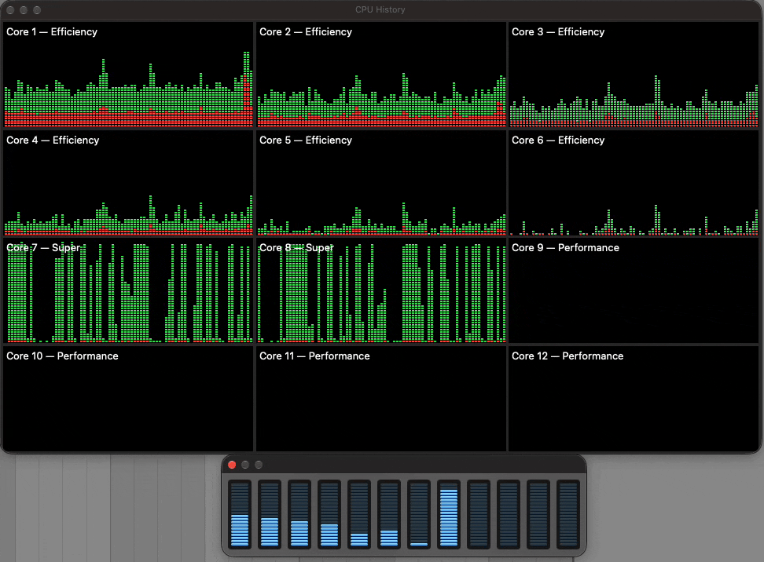
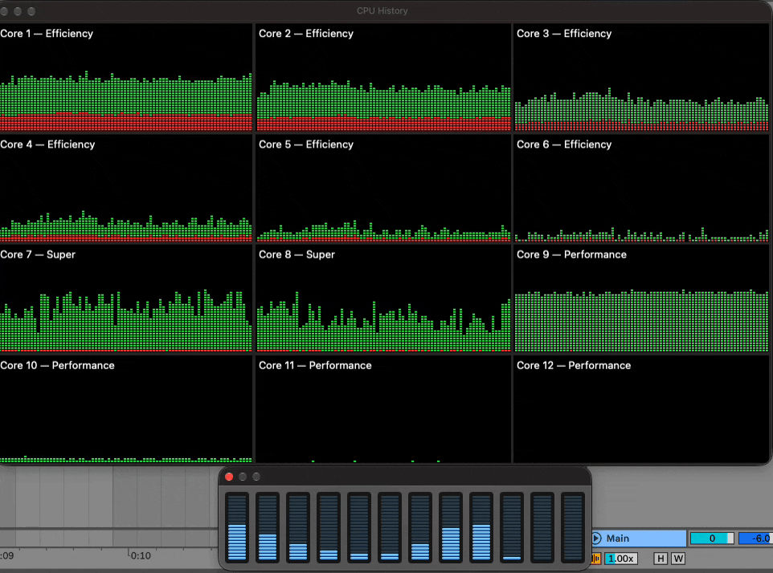
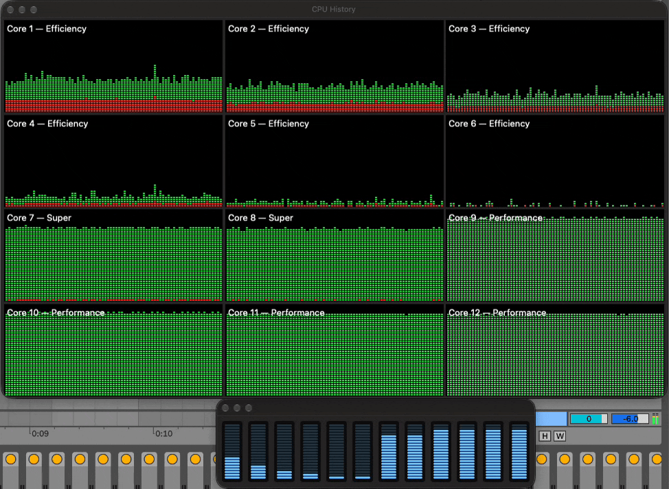
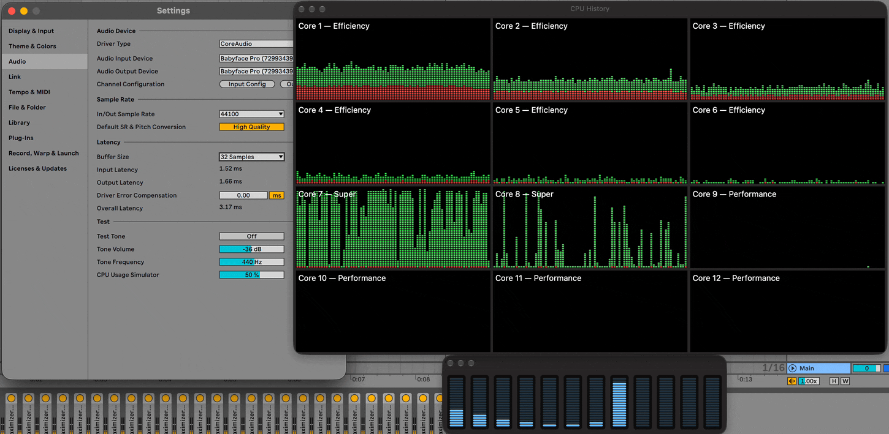
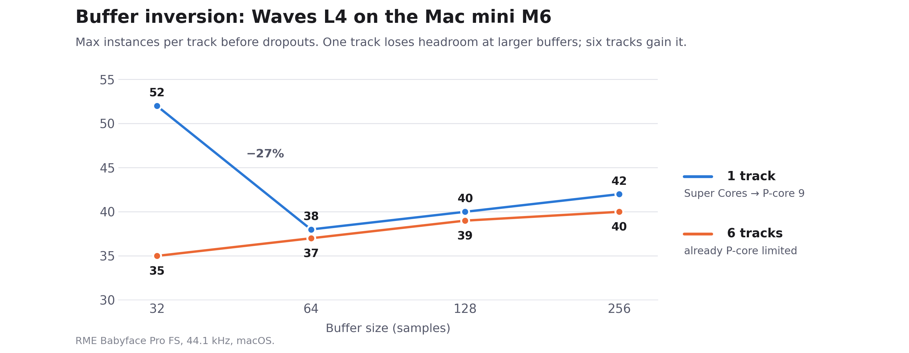
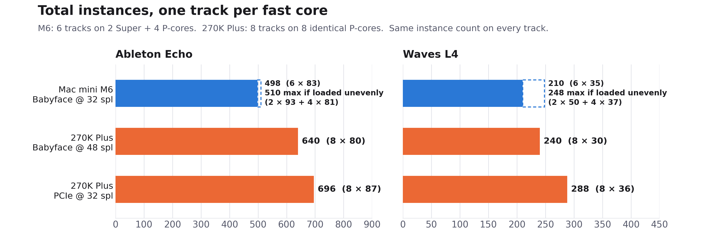

# Ableton Live 12
# Beyond P-Cores: How Apple's 3-Tier Silicon (M5/M6) Impacts Low-Latency DSP Buffer Scaling and Core Allocation

For years, the Apple Silicon pitch for music production was straightforward: high-IPC Performance cores handled real-time audio threads, while low-power Efficiency cores took care of background OS tasks. It was predictable. Every P-core had identical throughput, so multi-track sessions in Ableton Live scaled across the die in a clean, linear way.

Starting with the M5 Pro/Max and continuing into the M6, Apple moved to a three-tier layout: high-clocked **Super Cores (S-cores)**, mid-tier **Performance Cores (P-cores)**, and background **Efficiency Cores (E-cores)**.

While aggregate multi-threaded benchmark numbers keep climbing, having just a couple of top-tier cores creates an unexpected problem for low-latency audio. On the base M6 SoC, you only get **2 Super Cores** alongside 4 standard P-cores and 6 E-cores. When pushing low-latency sessions in Ableton Live 12, this asymmetric layout introduces an immediate compute bottleneck, core assignment uncertainty, and a strange buffer inversion effect.

## Test Rig & Baseline Setup

- **Apple Silicon:** Mac mini M6 (12-Core: 2 Super, 4 Performance, 6 Efficiency; 24 GB Unified Memory) running macOS Golden Gate.
- **x86 System:** Intel Core Ultra 7 270K Plus (8 Lion Cove P-cores; Live restricts its real-time MMCSS audio threads to them) and DDR5 CUDIMM 8800 MT/s, on Windows 11 Pro 25H2. Tuned with C-States off, turbo ratios locked at 5.4 GHz on the P-cores and 4.7 GHz on the E-cores, the Ultimate Performance power plan, and Virtualization-based Security / Core Isolation disabled.
- **DAW:** Ableton Live 12.
- **Audio Interfaces:** An RME Babyface Pro FS (USB 2.0 @ 44.1 kHz, running at 32 samples on macOS and 48 samples on Windows ASIO due to the driver floor), plus an internal RME HDSPe AIO Pro (PCIe @ 44.1 kHz / 32 samples) in the Intel rig to see the ceiling without USB driver overhead.
- **Drivers:** Latest RME DriverKit driver for the Babyface on macOS; I also tested RME's older kernel extension (kext) driver, with no difference in results. I also tried the HDSPe AIO Pro on the Mac via a Thunderbolt PCIe enclosure, but it performed no better than the Babyface, so I used the Babyface for all Mac tests. Latest RME ASIO drivers on Windows.

## The 1-Track Illusion and the Immediate 2-Track Spillover

A standard single-track stress test paints a deceptive picture of real-world silicon performance. If you run an isolated track at 32 samples with stacked mastering limiters (in this case, Waves L4 Ultramaximizer), Live sustains **51 to 52 instances** before audio breaks up.

*Note: the CPU History captures of the 1-, 2- and 6-track sessions show Ableton Echo; Waves L4 produces the same core pattern at lower instance counts. The buffer inversion capture further down is Waves L4.*

\
*1 track, 32 samples, Ableton Echo: the load alternates between Super Cores 7 and 8, while the P-cores (9–12) stay idle.*

The CPU History window shows what happens: the scheduler **time-shares the audio thread across both Super Cores (Cores 7 and 8)**, presumably to spread heat. Only one of them runs it at any moment (you can see the two graphs take turns), so the track gets roughly one Super Core's worth of processing, and the other S-core still has spare time.

Here is what happens the moment you add a **second track** with an identical copy of the same plugin chain:

\
*2 tracks, 32 samples, Ableton Echo: the second track's load lands on the P-cores (mainly Core 9), not on the spare Super Core time.*

Even though the second Super Core still has spare time, macOS doesn't give it to Track 2. Its load goes to the mid-tier P-cores, mostly Core 9. Don't expect Activity Monitor to show one core pinned at 100%, even right at the dropout limit: each bar averages about a second (well over a thousand callbacks at 32 samples), threads move between cores, and a dropout is caused by the single slowest callback, not the average. What the graphs do show is the split: the two Super Cores together carry roughly one track's worth of work, and the second track runs on P-cores.

Removing L4 instances from both tracks equally, one at a time on each, until the dropouts stopped, the limit came out at **38 instances per track**. That's the P-core ceiling: about 73% of a Super Core with Waves L4 (38 / 52). With Ableton Echo the gap is smaller, around 81–86% (88 per track on 2 tracks vs. 102 on one), so how much you lose depends on the plugin.

In DAW summing, every parallel channel has to deliver its rendered audio block within the exact same ~726 µs window before the hardware callback fires. The moment both tracks go to 39 instances, the entire session drops out. Just adding that second track drops your per-track headroom from **52 instances down to 38 instances**.

## Filling All Six Fast Cores: The Slowest Core Sets the Limit

I kept the same method as I expanded from 3 up to 6 tracks: each new track is a duplicate of the same plugin chain, and instances are removed from all tracks equally until the dropouts stop. The added load goes to the remaining mid-tier P-cores (Cores 10, 11, and 12).

This layout creates a real headache for uniform mixing and conventional DAW benchmarking. If you run a 6-track project and put an identical plugin chain on every track, the entire session caps at **210 instances** (6 tracks x 35 instances). If you push all tracks to 36, the four P-cores miss their buffer deadlines and cause audio dropouts—even though the two Super Cores are sitting there with roughly 30% unused headroom.

Breaking the symmetric method on purpose shows what's being left on the table. You can only reach the full compute ceiling of the M6 die by running an asymmetric load: manually pushing the two S-core tracks to 50 instances while keeping the four P-core tracks at 37 instances. That gives you (2 x 50) + (4 x 37) = **248 total instances**, recovering 38 instances (+18.1%) of stranded DSP power. With Ableton Echo the same trick gains far less: 2 × 93 + 4 × 81 = 510, only 12 instances (+2.4%) over the even load, because Echo's Super Core advantage over the P-cores is much smaller.

The catch is that you can't see or choose which tracks land on the Super Cores. To load them asymmetrically, I raised the instance count one track at a time by trial and error, listening for which tracks could take more without dropping out, with Activity Monitor open to watch the load shift. The ones that kept going were the tracks on the Super Cores (7 and 8). And that assignment isn't stable: reordering tracks, adding a return, or reopening the project makes Live rebuild its audio graph, and different tracks can end up on the Super Cores (more on this in the "Unpredictable Core Placement" section below).

When you look at that 6-channel project at 32 samples, you're seeing the chip's ideal case, with six tracks for six fast cores:

\
*6 tracks, 32 samples, Ableton Echo: Cores 7–12 all run near their limit, while the E-cores (1–6) stay near idle.*

Across the top row, the 6 Efficiency cores (Cores 1–6) hover near idle, as expected at 32 samples, where the deadline is tight enough to keep real-time threads on the fast cores anyway. Meanwhile, Cores 7 through 12 (both Super Cores and all four P-cores) form a solid green wall, running right up against the 32-sample deadline. On native Ableton Echo, this setup sustains 83 instances per track for a total of **498 instances**. On Waves L4, it delivers **210 instances** uniformly, or **248 instances** loaded asymmetrically.

## Unpredictable Core Placement: Trapped by macOS Scheduling

While Windows 11 lets applications or utilities use process affinity masks (`SetThreadAffinityMask`) to bind audio worker threads to specific physical cores, **macOS doesn't offer user-space core affinity**. Mach’s underlying `THREAD_AFFINITY_POLICY` only accepts abstract cache-sharing hints, and CoreAudio’s `os_workgroup` framework treats Super Cores and standard P-cores as a single, undifferentiated performance pool.

This creates real unpredictability in everyday use. Anytime you move a track in the arrangement, drop in a return send, or tweak a sidechain route, Live reconstructs its internal audio Directed Acyclic Graph (DAG). At the start of each buffer cycle, worker threads enter the execution queue—and presumably whichever track clears its graph dependencies a few microseconds earlier claims an S-core.

Because of this, Track 1 does not reliably land on an S-core. It can easily get pushed to Core 9 (P-core), while Tracks 2 and 3 grab the Super Cores (7 and 8). If a heavy mastering chain or oversampled synth lands on an S-core, playback is completely clean. But if you reload the project or nudge a track and that exact same chain lands on a P-core, it can immediately overload the core and cause audio dropouts, without changing a single setting in your project.

## The Buffer Inversion Effect: Why Raising the Buffer Can Hurt Headroom

Conventional wisdom says that raising your audio buffer from 32 samples up to 64, 128, or 256 samples creates a larger safety margin and reduces CPU stress. On 3-tier Apple Silicon with third-party plugins on a single track, the exact opposite happens.

\
*Waves L4 on a single track, switching the buffer from 32 to 64 samples: the load leaves Super Cores 7–8 and moves onto P-core 9.*

At 32 samples, the audio thread alternates between Super Cores 7 and 8, as in the single-track test above. As soon as the buffer is switched to 64 samples, the scheduler moves it off both Super Cores and onto a single mid-tier P-core (Core 9). You can see Cores 7 and 8 drop to near idle at the right edge of their graphs, while Core 9 picks up the whole load and Cores 10–12 stay idle.

The E-cores stay idle at every buffer size, so Ableton's `AppleSiliconBurstWorkaround` still does its job. It was built for exactly this situation on 2-tier chips, where larger buffers let macOS move the audio thread onto the E-cores. On 3-tier chips, though, the same demotion now happens one step up: from a Super Core to a P-core, which the workaround doesn't cover.

Because a P-core runs Waves L4 at roughly 73% of a Super Core's throughput, maximum headroom drops from 52 instances to **38 at 64 samples (−27%)**, exactly the P-core ceiling from the 2-track test. It only partly recovers at larger buffers: 40 at 128 and 42 at 256, still 19% below the 32-sample result. The same regression reproduced with FabFilter Saturn, in AUv2 and VST3. Native Live devices (like Echo) avoid this demotion, maintaining their Super Core allocation and scaling upward normally.

This only affects a single heavy track. With two or more tracks, the session is already limited by the P-cores, so a bigger buffer helps as usual:

\
*Waves L4 per track on the Mac mini M6: one track drops at 64 samples, six tracks rise.*

## Topology Comparison: Apple M6 vs. Intel Core Ultra 7 270K Plus

*Quick note on interfaces: The M6 Mac mini was tested via the RME Babyface Pro FS down to 32 samples. On Windows 11, the Babyface ASIO driver bottoms out at 48 samples. To provide both a direct interface-matched comparison and a true 32-sample test, the Intel 270K Plus was benchmarked on both the Babyface (USB @ 48 spl) and an internal RME HDSPe AIO Pro (PCIe @ 32 spl) to isolate CPU architecture from driver bus overhead.
In the tables, "Babyface" is the RME Babyface Pro FS (USB), "PCIe" is the RME HDSPe AIO Pro, and "spl" means samples.*

\
*Total instances with one track per fast core: Intel's 8 identical cores come out ahead of the M6's 2 Super + 4 P.*

### Table 1: Waves L4 Ultramaximizer (Third-Party VST)

| Metric | Apple M6 Mac mini (macOS) | Intel Core Ultra 7 270K Plus (Windows 11) | What it shows |
|---|---|---|---|
| **Fast cores** | 6 (2 Super + 4 P) | 8 Lion Cove P-cores | 33% more fast cores on Intel, all identical. |
| **Single track** | **52** (Babyface @ 32 spl) | **36** (Babyface @ 48 spl) | The M6 Super Core leads by ~44%. |
| **One track per fast core** | **210 total** (6 tracks @ 35/track) | **240 total** (8 tracks @ 30/track, Babyface @ 48) **288 total** (8 tracks @ 36/track, PCIe @ 32) | The Super Core wins on a single track; Intel's 8 identical cores win on total mix capacity. |
| **Spillover to slower cores** | From Track 2 | None (identical cores, Tracks 1–8) | The M6's tier asymmetry shows up immediately; Intel scales evenly across all 8 tracks. |
| **Larger buffers** | Per track at 32 → 64 → 128 → 256 spl: 1 track: **52 → 38 → 40 → 42** (drops) 6 tracks: **35 → 37 → 39 → 40** (rises) | Not tested | Only a single heavy track regresses on macOS, as its thread moves off the Super Cores. |

While an M6 Super Core beats an Intel Lion Cove P-core in single-track ceiling (52 vs. 36 Waves L4 instances), the M6's aggregate multi-track capacity falls behind because 4 out of its 6 fast cores are restricted to the lower ~35-instance mid-tier ceiling. On the 270K Plus, all 8 P-cores share identical IPC and clocks, so every track has the same ceiling. On the M6, a bigger buffer only hurts the single-track case, where it pulls the thread off the Super Cores; multi-track sessions are already P-core-limited and gain normally.

### Table 2: Ableton Echo (Native Live Device)

| Metric | Apple M6 Mac mini (macOS) | Intel Core Ultra 7 270K Plus (Windows 11) | What it shows |
|---|---|---|---|
| **Single track** | **102** (Babyface @ 32 spl) | **82** (Babyface @ 48 spl) **89** (PCIe @ 32 spl) | M6 Super Core leads by ~24% (Babyface) and ~15% (PCIe, same 32 spl). |
| **One track per fast core** | **498 total** (6 tracks @ 83/track) | **640 total** (8 tracks @ 80/track, Babyface @ 48) **696 total** (8 tracks @ 87/track, PCIe @ 32) | Intel delivers +28.5% (USB) and +39.8% (PCIe) more in total. |
| **Two tracks per fast core** | **504 total** (12 tracks @ 42/track) | **656 total** (16 tracks @ 41/track, Babyface @ 48) **688 total** (16 tracks @ 43/track, PCIe @ 32) | Intel's 8 identical cores keep a wide lead. |
| **Larger buffers** | Per track, 32 → 64 → 256 spl: 1 track: **102 → 107 → 110** 6 tracks: **83 → 86 → 90** | PCIe, 32 → 64 spl: **89 → 90** (1 track), **87 → 88** (8 tracks) Babyface, 48 → 64 spl: **82 → 88** (1 track), **80 → 87** (8 tracks) | Echo stays on the Super Cores, so it gains headroom. At 32 → 64, the M6 gains ~4% vs. ~1% for Intel on PCIe. |

Echo shows the same pattern as Waves L4: the M6 Super Core wins on a single track, but Intel's 8 identical cores win on total capacity. To check whether that comes from the 3-tier layout itself rather than Apple Silicon in general, Table 3 compares the M6 with the base M5, whose fast cores are all top tier.

### Table 3: MacBook Pro M5 vs. Mac mini M6 (Ableton Echo, 32 samples)

These are results for Live's native Echo device, measured earlier on a MacBook Pro with the base M5 (up to 4.61 GHz), using the same Live 12 version and RME Babyface Pro FS at 32 samples. Values are instances per track before dropouts:

| Tracks | MacBook Pro M5 (4 identical fast P-cores) | Mac mini M6 (2 Super + 4 P) |
|:---:|:---:|:---:|
| 1 | 96 | 102 |
| 4 | 90 | 84 |
| **1 → 4** | **−6%** | **−18%** |

The MacBook Pro M5's four fast cores are the same top tier Apple now calls Super Cores, so with one track per core it loses only 6% going from 1 to 4 tracks. The Mac mini M6 starts higher on a single track (102 vs. 96), but drops 18% to 84 per track at 4 tracks, because by then the load has reached its mid-tier P-cores. **At 4 tracks, the older MacBook Pro M5 actually comes out ahead.** The M5 runs used the identical Live project, a few weeks before the M6 tests. The MacBook Pro M5 was on macOS Tahoe and the Mac mini M6 on macOS Golden Gate, both at default settings.

## Understanding the Tradeoffs

Looking at the numbers side-by-side highlights two very different approaches to silicon design:

The M6 Super Core has a clear lead in single-track throughput (102 vs. 82 Echo instances, and 51–52 vs. 36 Waves L4 instances). For deep, indivisible serial strips like a live vocal tracking chain or a CPU-heavy virtual synth, the Super Core gives you more per-track headroom. But once your session expands to fill all performance cores, Intel’s 8 identical Lion Cove cores pull ahead. On native Echo over the exact same Babyface interface, the 270K Plus delivers 640 total instances compared to the M6's 498.

This isn't an Apple-versus-x86 difference, either: the MacBook Pro M5, with four identical top-tier cores, held up better from 1 to 4 tracks than the M6 (−6% vs. −18%), so the drop comes from the M6's mix of core tiers, not from Apple Silicon itself.

There's also a difference in buffer scaling. Native Live devices like Echo stay on the Super Cores and scale up normally as the buffer expands (+7.8% on M6). But on a single track, third-party plugins (Waves L4, FabFilter Saturn) trigger a buffer inversion effect on macOS: at 64 samples the thread gets demoted onto a single P-core, cutting headroom by 27%, and it's still 19% down at 256. My guess is that at larger buffers macOS decides the deadline isn't urgent enough to need a Super Core. With several tracks, bigger buffers help normally. I didn't test Waves L4 at larger buffers on Windows; with Echo over PCIe, Intel gained only ~1% from 32 to 64 samples, less than the M6's ~4% on the Babyface.

### Practical Takeaways for Everyday Mixing

Stacking 35 to 50 mastering limiters at a 32-sample buffer is an extreme synthetic benchmark meant to expose architectural boundaries, not a reflection of normal session workflow. For everyday projects—say, 30 tracks with stock EQs, standard compressors, virtual instruments, and send effects—an M5 Pro/Max or M6 Mac has abundant compute headroom and will run without a hitch. Most users will never need to look at Activity Monitor or micromanage track counts.

Where this actually matters is on indivisible serial chains during low-latency tracking. If you are running an intensive vocal strip, an amp sim with high oversampling, or a heavy mastering bus, that chain has to execute on a single core within your buffer window. Knowing that a standard P-core has roughly 15–30% less compute headroom, depending on the plugin, explains why a heavy chain might play back cleanly one day, but glitch the next after reordering tracks or reloading the session.

The takeaway here isn't to worry about which core each track happens to land on—if your session isn't clicking or dropping out, the OS and DAW are balancing the load just fine. But it does show that on 3-tier Apple Silicon, peak Super Core power functions more like a burst feature for isolated tracks than a sustained, expandable pool across your entire mix.

### Why Live, and What This Doesn't Cover

All of this is Ableton Live only. Live is the DAW I use every day, so that was an obvious influence on the choice, but it also turns out to suit this kind of test. Live processes every track in real time within each audio callback, rather than rendering ahead of the buffer the way some DAWs can for playback (Reaper's anticipative FX, for example). That makes it a direct probe of per-core real-time performance: every plugin chain has to meet the deadline on whatever core it lands on. DAWs that render ahead can hide some of these differences during playback, but armed or monitored tracks during low-latency tracking generally have to run in real time there too, which is exactly the scenario where this matters most.
